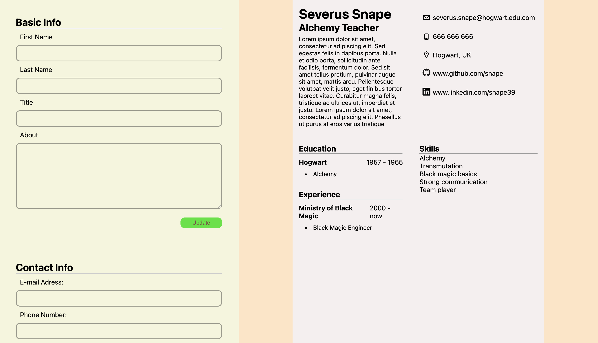

This is a cv creator app, made to practice the basics of react. 

The scope of what i practiced was:
- Creating react components
- Using props and passing them from components to components
- Using state to manage the ui changes made by user

This app was made mostly to practice, and as such, i think it is ready. However, if at any point i would like to include it as a portfolio piece, there are some improvements i would like to add: 
- Make the website mobile responsive, which it is not at the moment
- Experiment with fonts and maybe choose one, that is not a system font. 
- Refactor the react code AND the css code, as they are a huge bowl of spaghetti right now. 
- Address the errors shown in the console when rendering the edit popup.
- Include an option to exit the edit popup without editing any existing data
- Improve forms (Include form validation, template values, maybe regex in some inputs)
- Include a dark mode
- Include a way to change the output into a PDF and download it (maybe using https://react-pdf.org/)

